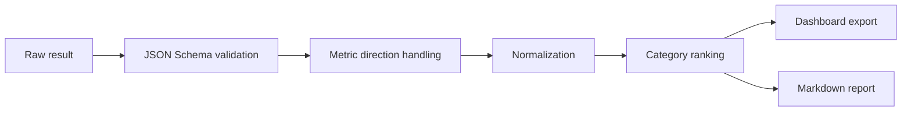

# Benchmarking System

This directory contains the reproducible benchmark architecture for the Claude Skills Observatory.

## Principles

1. Preserve raw results.
2. Record model and provider versions exactly.
3. Separate measured facts from editorial interpretation.
4. Never mix incompatible benchmark editions without an explicit mapping.
5. Prefer category rankings over a single universal leaderboard.
6. Mark synthetic, estimated, vendor-reported and independently reproduced results.
7. Keep all transformations reproducible.

## Directory layout

```text
benchmarks/
├── config/
│   ├── metrics.yml
│   └── normalization.yml
├── data/
│   ├── model-registry.json
│   └── sample-results.json
├── schema/
│   └── benchmark-result.schema.json
├── methodology.md
└── README.md
```

## Data pipeline



## Commands

```bash
python scripts/benchmark/validate_results.py
python scripts/benchmark/generate_rankings.py
python scripts/benchmark/export_dashboard_data.py
```

Generated files:

```text
benchmarks/generated/rankings.json
benchmarks/generated/rankings.md
dashboards/benchmarks/data/benchmark-dashboard.json
```

The included dataset is synthetic and exists only to test the pipeline.
