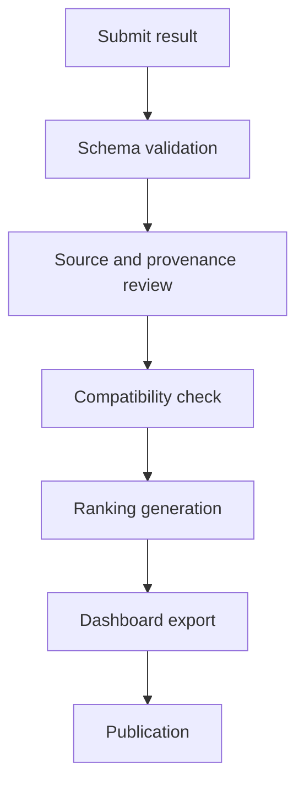

# Benchmark Methodology

## 1. Scope

The Observatory compares model performance across separate categories:

- reasoning;
- coding;
- mathematics;
- multimodal understanding;
- agents and tool use;
- latency;
- cost efficiency;
- context handling;
- reliability and hallucination resistance.

A model may perform strongly in one category and poorly in another. The project therefore publishes category rankings first and treats any aggregate score as optional.

## 2. Result provenance

Every result must declare one provenance type:

| Type | Meaning |
|---|---|
| `independent` | Reproduced by an independent evaluator |
| `official` | Published by the model provider |
| `community` | Published by a third-party community project |
| `synthetic` | Artificial example used only for testing |
| `estimated` | Derived estimate; excluded from default rankings |

Default public rankings include `independent`, `official`, and `community` results, while clearly exposing provenance filters.

## 3. Required metadata

Each record must include:

- benchmark identifier;
- benchmark version or edition;
- metric identifier;
- score;
- score direction;
- model identifier;
- exact model version;
- evaluation date;
- provenance;
- source reference;
- reproducibility status.

## 4. Metric direction

Metrics use one of two directions:

- `higher_is_better`;
- `lower_is_better`.

Examples:

- accuracy: higher is better;
- pass rate: higher is better;
- latency: lower is better;
- cost per task: lower is better;
- error rate: lower is better.

## 5. Normalization

Normalization is performed only within the same:

- benchmark;
- benchmark version;
- metric;
- evaluation protocol.

Default min-max normalization:

For higher-is-better metrics:

```text
normalized = (score - minimum) / (maximum - minimum)
```

For lower-is-better metrics:

```text
normalized = (maximum - score) / (maximum - minimum)
```

When all values are equal, each result receives `0.5`.

Normalized values are multiplied by 100 for display.

## 6. Aggregation

Category scores are weighted arithmetic means of normalized metrics.

```text
category_score =
sum(normalized_metric × metric_weight)
/
sum(metric_weight)
```

Rules:

1. Missing metrics are not silently converted to zero.
2. A model must meet the category's minimum coverage threshold.
3. Rankings expose the number of contributing metrics.
4. Ties are preserved when rounded scores are equal.
5. Estimated results are excluded unless explicitly enabled.

## 7. Coverage

Each category declares a minimum coverage ratio.

Example:

```yaml
reasoning:
  minimum_coverage: 0.60
```

A model with fewer than 60% of the expected metrics is marked `insufficient_coverage`.

## 8. Duplicate handling

When multiple valid results exist for the same model, benchmark, version and metric:

1. prefer independently reproduced results;
2. otherwise prefer the most recent compatible evaluation;
3. retain all raw records for auditability;
4. expose the selected record in generated outputs.

## 9. Benchmark versioning

Results from different benchmark editions are not merged by default.

```text
benchmark-x@1.0 != benchmark-x@2.0
```

Cross-version comparisons require an explicit compatibility mapping in configuration.

## 10. Model identity

The registry separates:

- display name;
- provider;
- model family;
- exact API or release identifier;
- release date;
- status;
- modalities.

Aliases must resolve to a canonical model ID.

## 11. Reproducibility

Each result records one status:

- `not_attempted`;
- `partial`;
- `reproduced`;
- `failed`.

A reproducibility note may include:

- hardware;
- software versions;
- prompts;
- sampling parameters;
- dataset hash;
- evaluator version.

## 12. Confidence and uncertainty

Where available, store:

- sample size;
- standard deviation;
- confidence interval;
- number of runs.

The first release of the ranking engine does not merge confidence intervals into the score. They remain visible for inspection and future statistical analysis.

## 13. Editorial safeguards

The Observatory must not:

- present synthetic data as real;
- hide provenance;
- combine incompatible benchmark versions;
- infer missing scores;
- rank a model with insufficient category coverage;
- copy provider marketing claims without attribution;
- treat a single aggregate score as definitive.

## 14. Update process


