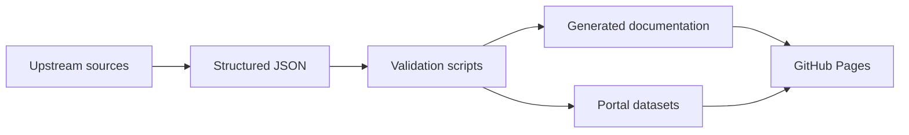

  English portal
  <h1>Observe the AI tool ecosystem with evidence.</h1>
  
The Claude Skills Observatory organizes technical knowledge into verifiable catalogs, reproducible benchmarks and decision-ready dashboards.

  

    <a class="cso-button cso-button--primary" href="dashboard/">Open dashboard</a>
    <a class="cso-button" href="skills/catalog/">Explore Skills</a>
  

## Architecture

## Initial coverage

- official starter Skills catalog;
- benchmark methodology and pipeline;
- English and Portuguese documentation;
- responsive dashboard;
- automated validation and deployment.
