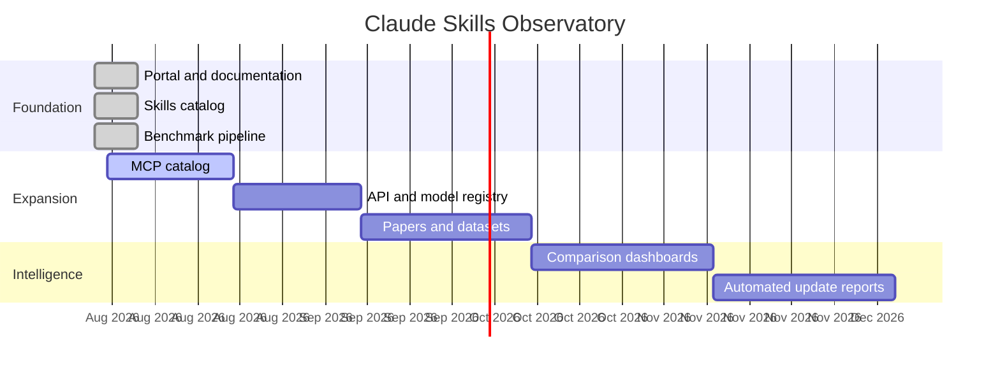

# Roadmap

## Priorities

1. Expand the verified catalog without sacrificing provenance.
2. Add MCP servers and API registries.
3. Replace synthetic benchmark examples with sourced evaluations.
4. Increase translation coverage.
5. Add contribution and review workflows.
