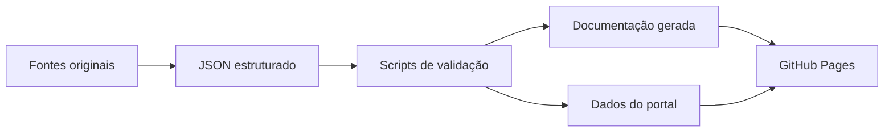

  Portal em português
  <h1>Observe o ecossistema de ferramentas de IA com evidências.</h1>
  
O Claude Skills Observatory organiza conhecimento técnico em catálogos verificáveis, benchmarks reproduzíveis e dashboards voltados à tomada de decisão.

  

    <a class="cso-button cso-button--primary" href="dashboard/">Abrir dashboard</a>
    <a class="cso-button" href="skills/catalog/">Explorar Skills</a>
  

## Arquitetura

## Cobertura inicial

- catálogo inicial de Skills oficiais;
- metodologia e pipeline de benchmarks;
- documentação em inglês e português;
- dashboard responsivo;
- validação e publicação automatizadas.
