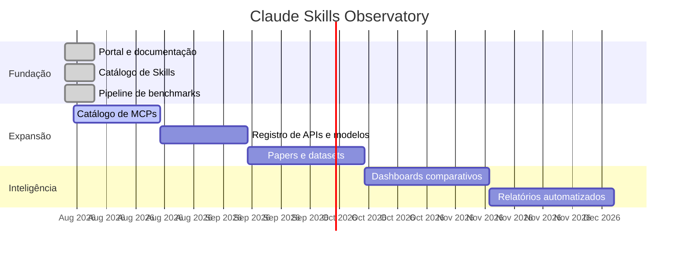

# Roadmap

## Prioridades

1. Ampliar o catálogo verificado sem perder a procedência.
2. Adicionar servidores MCP e registros de APIs.
3. Substituir exemplos sintéticos de benchmark por avaliações referenciadas.
4. Aumentar a cobertura de traduções.
5. Implantar fluxos de contribuição e revisão.
